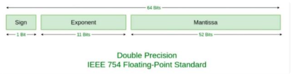

[toc]

## 为什么JS中0.1+0.2!==0.3​以及解决办法

### 一、为什么0.1+0.2!==0.3

```js
> 0.1+0.2===0.3
false
> 0.1+0.2
0.30000000000000004
```

这是一段奇怪的代码，想要搞清楚其中的缘由，首先需要了解计算机中浮点数是如何存储的。

#### 1. 浮点数的二进制存储

`JavaScript`遵循的是`IEEE754`标准，使用双精度浮点数，即在64位中存储一个数据的有效数字形式。如图所示，其中，第0位为符号位，0表示正数1表示负数；第1到11位存储指数部分；第12到63位存小数部分（尾数部分）（即有效数字）。由于二进制的有效数字总是表示为 1.xxx…的形式，尾数部分在规约形式下的第一位默认为1，故存储时第一位省略不写，尾数部分f存储有效数字小数点后的xxx...，最长52位。因此，JavaScript提供的有效数字最长为53个二进制位（尾数部分52位+被省略的1位）。



而将0.1转化为二进制后，是一个二进制无限循环小数，因此对52位之后进行舍入运算。

#### 2. IEEE754标准下的舍入规则

近似需要看三位，保留位（近似后的最低位，即第52位）、近似位（保留位的后一位）、粘滞位（sticky bit 近似位后的所有位进行或运算后看作一位）。满足如下规则：

- 当粘滞位为1时，舍入规则可以看作0舍1入，近似位为0舍，近似位为1入
- 当粘滞位为0时，若近似位为0则舍去
- 当粘滞位为0时，若近似位为1，无论舍入精度损失都相同，故需取舍入两种结果中的偶数：保留位为1时入，保留位为0时舍

这是第一处精度损失


#### 3. 浮点数运算

除了舍入会带来精度损失之外，浮点数的运算也有精度损失。以下是我查到的关于JS中浮点数运算的过程：

1. 对阶：对阶是将两个进行运算的浮点数的阶码对齐的操作。因为只有使两浮点数的指数值部分相同，才能将相同的指数值作为公因数提出来，然后进行尾数的加减运算。具体方法为：求出两浮点数阶码的差，即⊿E＝Ex-Ey，将小阶码加上⊿E，使之与大阶码相等，同时将小阶码对应的浮点数的尾数右移相应位数，以保证该浮点数的值不变。几点注意：
   - 对阶的原则是小阶对大阶。因为若大阶对小阶，则尾数的数值部分的高位需移出，而小阶对大阶移出的是尾数的数值部分的低位，这样损失的精度更小
   - 采用补码表示的尾数右移时，符号位保持不变
   - 由于尾数右移时是将最低位移出，会损失一定的精度，为减少误差，可先保留若干移出的位，供以后舍入处理用
2. 尾数运算：主要为进行完成对阶后的尾数相加减的相关操作（包含隐藏位），采用双符号法判断是否溢出。
3. 结果规格化，主要分为三种 向右规格化：若上一步出现溢出，则尾数右移1位，阶码+1; 向左规格化：若上一步没有出现溢出，且数值域最高位与符号位数值相同，则尾数左移1位且阶码-1，直到数值域最高位为1为止。
4. 舍入处理
5. 溢出判断


#### 总结：

在JS中0.1和0.2的二进制表示为：

```js
0.1 = 1.1001100110011001100110011001100110011001100110011010 * 2^-4
0.2 = 1.1001100110011001100110011001100110011001100110011010 * 2^-3
```

依照小阶对大阶的原则，我们需要将 0.1 的阶码变为 -3，因此其尾数部分需要右移一位。对阶之后 0.1 的存储为

```js
0.1 = 0.11001100110011001100110011001100110011001100110011010 * 2^-3
```

右移一位导致尾数需要进行阶段，因为最后一位刚好是0，所以这里直接舍弃，因此 0.1 对阶之后的存储为

```js
0  01111111100  1100110011001100110011001100110011001100110011001101 
--------------------------------------------------------------------
S  E(阶码-3)   M
```

阶码相等后就可以计算了

```js
   0  01111111100   1100110011001100110011001100110011001100110011001101
+  0  01111111100   1001100110011001100110011001100110011001100110011010
-------------------------------------------------------------------
=  0  01111111100  10110011001100110011001100110011001100110011001100111
```

可以看到发生了进位，此时尾数超过52,这时候要进位，阶码+1(这里数学运算不解释了),阶码是指数最后一位省略掉，因为最后一位是1，根据上之前上面的规则（四舍五入），最后结果

```js
0  1111111101  1011001100110011001100110011001100110011001100110100
```

转为10进制

```js
2^-2 + (1+(1*2^-1 + 0 * 2^-2+1*2^-3+1*2^-4+... ) = 0.3000000000000000444089209850062616169452667236328125
```

也就是`0.30000000000000004`


### 二、解决方法

#### 1. 扩大10的N次方倍进行计算

这是我想到的最简单的方法

```js
> (0.1*100+0.2*100)/100===0.3
true
```


#### 2. `Number.EPSILON`

`Number.EPSILON`属性表示 1 与Number可表示的大于 1 的最小的浮点数之间的差值。

```js
> 0.1+0.2-0.3<Number.EPSILON
true
```


#### 3. `toFixed()`

`toFixed()` 方法可把 Number 四舍五入为指定小数位数的数字的**字符串**

```js
> (0.1+0.2).toFixed(8)==0.3
true
```


> 参考资料
>
> https://developer.mozilla.org/zh-CN/
>
> https://www.w3school.com.cn/
>
> https://segmentfault.com/a/1190000018230594?utm_source=sf-similar-article
>
> https://segmentfault.com/a/1190000012175422
>
> https://blog.csdn.net/weixin_46773434/article/details/110081725